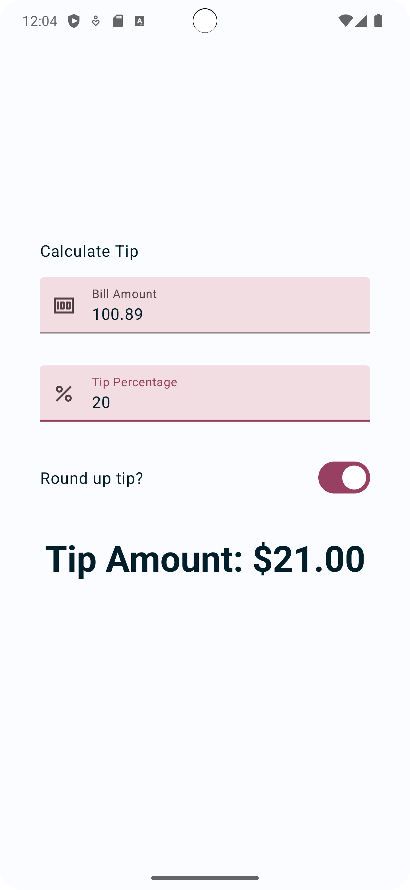

Tip Time
=================================

A Tip app that calculates the tip. When the user enters a bill amount, the app will display a suggested tip amount. It's developed using Jetpack Compose components like ```Column```, ```Button```, ```Text```, ```Image```, and ```Modifier```.


<p align="center">
  
</p>

Getting Started
---------------
1. Install Android Studio, if you don't already have it.
2. Download the sample.
3. Import the sample into Android Studio.
4. Build and run the sample.
